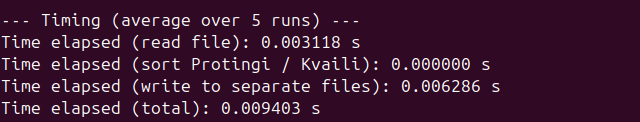
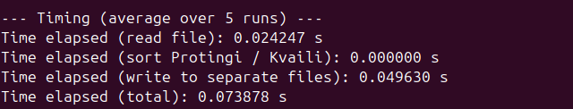
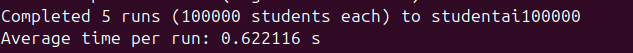
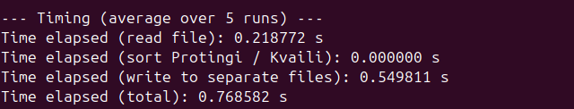
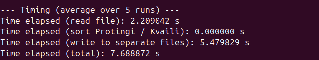
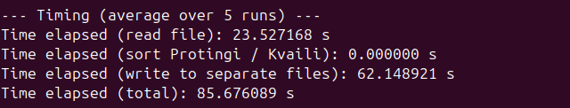

# Testavimo rezultatai

Šiame dokumente pateikiami programos našumo matavimai skirtingo dydžio duomenų imtims. Kiekvienai imčiai atliekami du bandymai (meniu punktai **7** ir **8**): kiekvienas veiksmas kartojamas **5 kartus** ir skaičiuojamas **vidutinis laikas** (vienas įrašas = vieno bandymo trukmė).

1. **Duomenų generavimas ir įrašymas** — studentų įrašai sugeneruojami ir įrašomi į vieną failą (`studentai<N>`).
2. **Skaidymas į kategorijas** — įrašai nuskaitomi iš failo, skaidomi į **protingus** ir **kvailius** (pagal galutinį balą), rezultatai rašomi į atskirus failus; atskirai matuojami nuskaitymas, rūšiavimas ir rašymas.

---

## 1000 studentų

### Generavimas ir įrašymas į failą

| Veiksmas | Rezultatas |
|----------|------------|
| Įrašyta į failą | `studentai1000` |
| Vidutinis laikas (5 band.) | **0,007114 s** |

### Nuskaitymas, skaidymas ir rašymas į atskirus failus

| Etapas | Vidutinis laikas (5 band.) |
|--------|----------------------------|
| Failo nuskaitymas | **0,003118 s** |
| Rūšiavimas (Protingi / Kvaili) | **0,000000 s** |
| Rašymas į atskirus failus | **0,006286 s** |
| **Iš viso** | **0,009403 s** |

---

## 10 000 studentų

### Generavimas ir įrašymas į failą

| Veiksmas | Rezultatas |
|----------|------------|
| Įrašyta į failą | `studentai10000` |
| Vidutinis laikas (5 band.) | **0,062111 s** |

### Nuskaitymas, skaidymas ir rašymas į atskirus failus

| Etapas | Vidutinis laikas (5 band.) |
|--------|----------------------------|
| Failo nuskaitymas | **0,024247 s** |
| Rūšiavimas (Protingi / Kvaili) | **0,000000 s** |
| Rašymas į atskirus failus | **0,049630 s** |
| **Iš viso** | **0,073878 s** |

---

## 100 000 studentų

### Generavimas ir įrašymas į failą

| Veiksmas | Rezultatas |
|----------|------------|
| Įrašyta į failą | `studentai100000` |
| Vidutinis laikas (5 band.) | **0,622116 s** |

### Nuskaitymas, skaidymas ir rašymas į atskirus failus

| Etapas | Vidutinis laikas (5 band.) |
|--------|----------------------------|
| Failo nuskaitymas | **0,218772 s** |
| Rūšiavimas (Protingi / Kvaili) | **0,000000 s** |
| Rašymas į atskirus failus | **0,549811 s** |
| **Iš viso** | **0,768582 s** |

---

## 1 000 000 studentų

### Generavimas ir įrašymas į failą

| Veiksmas | Rezultatas |
|----------|------------|
| Įrašyta į failą | `studentai1000000` |
| Vidutinis laikas (5 band.) | **6,652654 s** |

### Nuskaitymas, skaidymas ir rašymas į atskirus failus

| Etapas | Vidutinis laikas (5 band.) |
|--------|----------------------------|
| Failo nuskaitymas | **2,209042 s** |
| Rūšiavimas (Protingi / Kvaili) | **0,000000 s** |
| Rašymas į atskirus failus | **5,479829 s** |
| **Iš viso** | **7,688872 s** |

---

## 10 000 000 studentų

### Generavimas ir įrašymas į failą

| Veiksmas | Rezultatas |
|----------|------------|
| Įrašyta į failą | `studentai10000000` |
| Vidutinis laikas (5 band.) | **75,975213 s** |

### Nuskaitymas, skaidymas ir rašymas į atskirus failus

| Etapas | Vidutinis laikas (5 band.) |
|--------|----------------------------|
| Failo nuskaitymas | **23,527168 s** |
| Rūšiavimas (Protingi / Kvaili) | **0,000000 s** |
| Rašymas į atskirus failus | **62,148921 s** |
| **Iš viso** | **85,676089 s** |

---

*Matavimai atlikti toje pačioje aplinkoje (meniu punktai 7 ir 8, po 5 bandymus); konkretūs skaičiai gali skirtis priklausomai nuo aparatinės įrangos ir apkrovos.*
